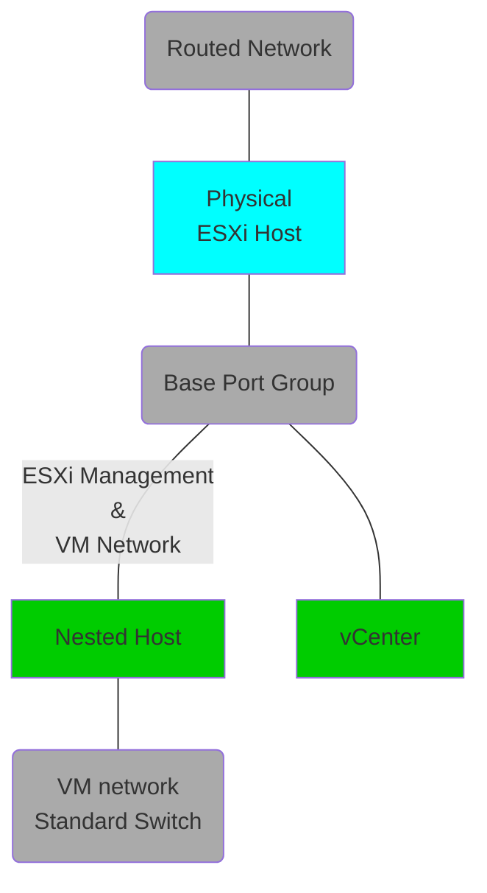

# Base vSphere

# Tested Versions
- vSphere 7.0 U3 and 8.0 U1

## Architecture
Below is the layout of the opinionated deployment, which can be customized by editing the vars file.  

- A single vCenter will be added.
- Within the nested host the `vm-network` port group can be use to attach VMs to the routed network that has been passed through.

