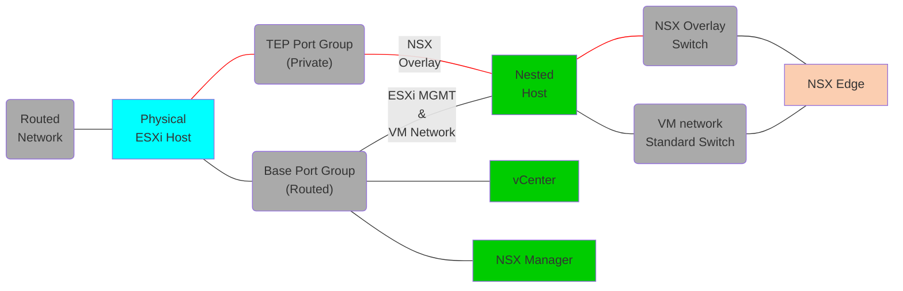

# NSX-T

## Depends on
All base instructions. It is recommended to attempt a minimal deployment to first become comfortable with the processes.

# Tested Versions
- NSX-T 3.0.3, 3.1.3, 3.2.3, 4.0.1
  - NSX-T 4.1 is not currently supported due to breaking changes in the transport_zone module
- vSphere 7.0 U3 and 8.0 U1

## Additional Dependencies
- The NSX-T ISO must be added to your software directory and the filename updated in the vars file.  
- You need a valid NSX-T license.
- On top of the standard routed network, you need a port group to use for the overlay, which does not need to be routable unless you want to run multiple nested ESXi hosts.
- After the deployment you will need to add a static route to the T0 gateway uplink for any addresses that will be behind NSX-T.

## Architecture
Below is the layout of the opinionated deployment, which can be customized by editing the vars file.</br>



</br>
- The NSX-T Manager VM will be deployed as a standard VM on your physical host.
- A single vCenter will be added.
- All components will be added to a single nested ESXi host. This can be customized by editing the yaml.
- A single T0 gataway will be deployed and the T0 uplink will share the same network as the management interfaces in vmnic0
- If you want to have more that 1 nested host, then your tep network should be set to MTU of at least 1600 to allow the hosts to communicate.
- The tep network is used twice on the nested ESXi hosts because the edge tep port group cannot be on the same VDS that will be used by the host transport nodes.

## Instructions
In addition to the base instructions you will need to export the NSX-T license key as a variable called `NSXT_LICENSE_KEY`. E.g.
```
export NSXT_LICENSE_KEY=AAAAA-BBBBB-CCCCC-DDDDD-EEEEE
```
You can now use the run command from the base instructions pointing to your updated nsxt vars file.

## IP Assignment on opinionated deployment

vCenter = `hosting_network.base.starting_addr`<br/>
NSX Manager = `hosting_network.base.starting_addr + 1`<br/>
router uplink = `hosting_network.base.starting_addr + 3`<br/>
First ESXi host = `hosting_network.base.starting_addr + 8`<br/>

## Known Issues
- Creation of the first VLAN segments can take some time whilst the Transport Zones are configured.
- A number of Ansible for NSX-T modules are not properly idempotent and report changed even though no change has been made.