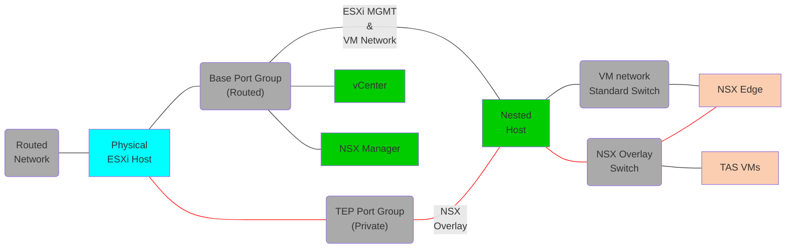

# Tanzu Application Service with NSX-T

This pattern will deploy NSX-T and TAS.

## Tested Versions
- TAS 2.11, 2.13 and 4.0
- NSX-T 3.2.3 & 4.0.1
- vSphere 7.0 U3k

## Dependencies
- The NSX-T OVA, Opsman OVA, TAS tile and Stemcell must must be added to your software directory and the filenames updated in the vars file.
- You need a valid NSX-T license.
- On top of the standard routed network, you need a port group to use for the overlay, which does not need to be routable.
- During the deployment you will need to add a static route to the T0 gateway uplink for any addresses that will be behind NSX-T.
- The OM CLI is used for all TAS related tasks. This is included in v8+ of the docker image.

## Architecture
Below is the layout of the opinionated deployment, which can be customized by editing the vars file.</br></br>



</br>

- The NSX-T Manager VM will be deployed as a standard VM on your physical host.
- A single vCenter will be added and attached to the physical host.
- All components will be added to a single nested ESXi host. This can be customized by editing the yaml.
- A single T0 gateway will be deployed and the T0 uplink will share the same network as the management interfaces in vmnic0
- If you want to have more that 1 nested host, then your TEP network should be set to MTU of at least 1600 to allow the nested ESXi hosts to communicate and you must switch to using NFS shared storage as per [this example](../../base-vsphere/minimal-opinionated-nfs.yml).
- During setup you will be prompted to add a static route to the T0 uplink when created.
- A single T1 router and segment will be added, which will be used to host Opsman, Bosh, TAS.

## Instructions
In addition to the base instructions you will need to export the NSX-T license key as a variable called `NSXT_LICENSE_KEY`. E.g.
```
export NSXT_LICENSE_KEY=AAAAA-BBBBB-CCCCC-DDDDD-EEEEE
```
You can now use the run command from the base instructions pointing to your updated nsxt vars file.

## IP Assignment on opinionated deployment

vCenter = `hosting_network.base.starting_addr`<br/>
NSX Manager = `hosting_network.base.starting_addr + 1`<br/>
Router uplink = `hosting_network.base.starting_addr + 3`<br/>
First ESXi host = `hosting_network.base.starting_addr + 8`<br/>
Opsman = `opinionated.tas.routeable_super_net + 2`<br/>

## Troubleshooting
- Creation of the first VLAN segments can take some time whilst the Transport Zones are configured. If this fails on the first attempt, retry the playbook and open an issue to report the wait time needs increasing.
- A number of Ansible for NSX-T modules are not properly idempotent and report changed even though no change has been made.