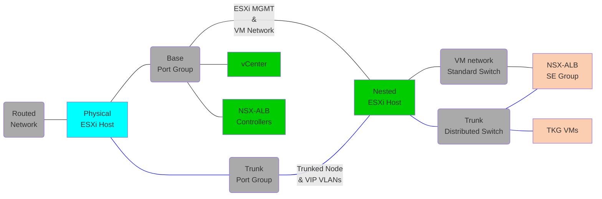
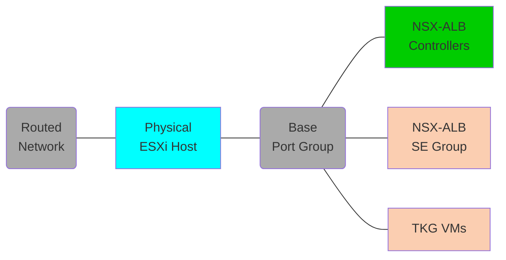

# Tanzu Multi-Cloud with Avi Load Balancer
This will deploy using the standard 2 network topology

## Tested Versions
- NSX ALB Controller 22.1.4
- Tanzu Kubernetes Grid 2.4.0

## Additional Dependencies
In addition to the base dependencies, you will need to download and store the NSX-ALB OVA file in your software directory:
- [Tanzu download page](https://my.vmware.com/en/group/vmware/downloads/info/slug/infrastructure_operations_management/vmware_tanzu_kubernetes_grid/1_x)

## Architecture Nested
Below is the layout of the opinionated deployment, which can be customized by editing the vars file.</br></br>



</br>

- A single vCenter will be added.
- 2 networks are required. 
  - The base network must be a standard port group, where VMs can attach. This will appear as `vm-network` in the nested cluster.
  - The workload network can be on a standard port group or a trunk port group, where the nested host will add a VLAN tag. This will appear as `workload-pg` in the nested cluster.
  - DHCP must be setup on the workload network.
- NSX_ALB Controllers and Service Engine management interfaces will be added to `vm-network` on the 2nd and 3rd IP after the starting address.

## Architecture Not Nested
Below is the layout of the opinionated deployment, which can be customized by editing the vars file.</br></br>



</br>

- 1 network is required. 
  - The base network must be a standard/distributed port group, where VMs can attach.
  - DHCP must be setup on the workload network to use the default TKGM management cluster yaml, although it can be modified to use node IPAM
- NSX_ALB Controllers and Service Engine management interfaces will be added to `vm-network` on the 2nd and 3rd IP after the starting address.

## Instructions
In addition to the base instructions you will need to export the NSX-ALB (Avi) default password, which can be found on the Controller Ova download page.
```
export AVI_DEFAULT_PASSWORD=#######
```
You can now use the run command from the base instructions pointing to your updated vars file.

## IP Assignment on opinionated deployment

vCenter = `hosting_network.base.starting_addr`<br/>
Avi Controller = `hosting_network.base.starting_addr + 1`<br/>
First ESXi host = `hosting_network.base.starting_addr + 4`<br/>

## Known Issues
- Creation of the first VLAN segments can take some time whilst the Transport Zones are configured.
- A number of Ansible for NSX-T modules are not properly idempotent and report changed even though no change has been made.