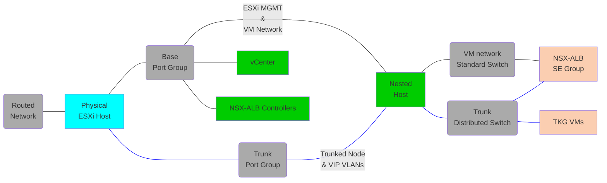

# Tanzu Kubernetes for vSphere with Distributed Switching
This will deploy using the standard 2 network topology

## Tested Versions
- vSphere 7.0 U3i and 8.0 U1
- NSX ALB Controller 22.1.5

# Dependencies
In addition to the base dependencies, you will need to download and store the NSX-ALB OVA file in your software directory:
- [Tanzu download page](https://my.vmware.com/en/group/vmware/downloads/info/slug/infrastructure_operations_management/vmware_tanzu_kubernetes_grid/1_x)

## Architecture
Below is the layout of the opinionated deployment, which can be customized by editing the vars file.  

 

- A single vCenter will be added.
- 2 networks are required. 
  - The base network must be a standard port group, where VMs can attach. This will appear as `vm-network` in the nested cluster.
  - The workload network can be on a standard port group or a trunk port group, where the nested host will add a VLAN tag. This will appear as `workload-pg` in the nested cluster.
- NSX_ALB Controllers and Service Engine management interfaces will be added to `vm-network` on the 2nd and 3rd IP after the starting address.

# IP Assignment on opinionated deployment

vCenter = `hosting_network.base.starting_addr` 
Avi Controller = `hosting_network.base.starting_addr + 1` 
first ESXi host = `hosting_network.base.starting_addr + 8` 

# Troubleshooting
- During creation the API will return errors for an extended period. The module will accept up to 150 seconds of errors, if the playbook ends with an error, check the UI to see if the action is progressing.

# Roadmap
- Add multi host option
- Add functionality to check and apply updates
- Add ability to shrink to 2 supervisors
  https://www.virtuallyghetto.com/2020/04/deploying-a-minimal-vsphere-with-kubernetes-environment.html
