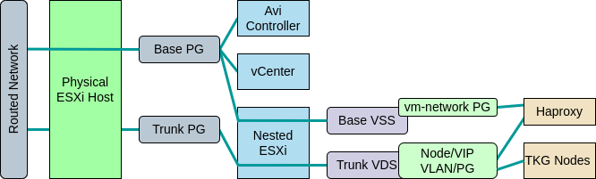

# Tanzu Kubernetes for vSphere with Distributed Switching
This will deploy using the standard 2 network topology

# Dependencies
In addition the base dependencies, the following files need to be downloaded and stored in the software directory:
- [VMware HA Proxy OVA](https://github.com/haproxytech/vmware-haproxy/releases/tag/v0.1.8)

## Architecture
Below is the layout of the opinionated deployment, which can be customized by editing the vars file.

- A single vCenter will be added.
- 2 networks are required. 
  - The base network must be a standard port group, where VMs can attach. This will appear as `vm-network` in the nested cluster.
  - The workload network can be on a standard port group or a trunk port group, where the nested host will add a VLAN tag. This will appear as `workload-pg` in the nested cluster.
- The Haproxy management interface will be added to `vm-network` on the 2nd and 3rd IP after the starting address.

# Routing
By default a router will be created to bridge the workload and management networks. To be able to access resources deployed, you will need to add a static route to the router uplink which is the next IP after `hosting_network.base.starting_addr`  
If you want to provide your own routing, you can remove the `router` section under `tkgs` and then setup your own routing for the network defined in `tkgs_workload_cidr`.

# IP Assignment on opinionated deployment

vCenter = `hosting_network.base.starting_addr` 
router uplink = `hosting_network.base.starting_addr + 1` 
first ESXi host = `hosting_network.base.starting_addr + 8` 

# Troubleshooting
- During creation the API will return errors for an extended period. The module will accept up to 150 seconds of errors, if the playbook ends with an error, check the UI to see if the action is progressing.

# Roadmap
- Add multi host option
- Add functionality to check and apply updates
- Add ability to shrink to 2 supervisors
  https://www.virtuallyghetto.com/2020/04/deploying-a-minimal-vsphere-with-kubernetes-environment.html
