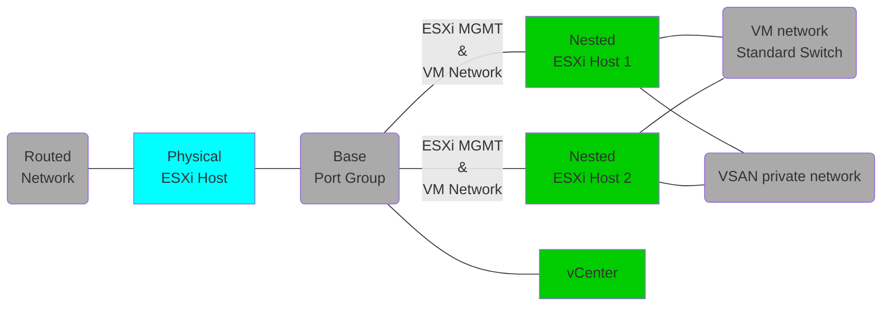

# Base vSphere

# Tested Versions
- vSphere 8.0 U3

## Architecture
Below is the layout of the opinionated deployment, which can be customized by editing the vars file.  

- A single vCenter will be added.
- 2 hosts are added without shared storage
- Within the nested host the `vm-network` port group can be use to attach VMs to the routed network that has been passed through.
- An internal only VDS is added for VSAN traffic

